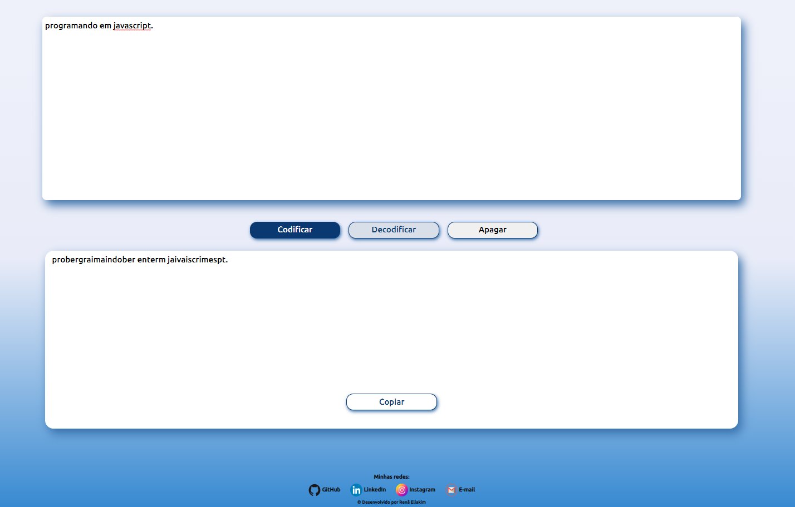

<h1 align="center"> Codificador e Decodificador de textos </h1>

Sistema desenvolvido  no Challenge do programa ONE  (Oracle Next Education) para aprimorar habilidades em JavaScript.

  <a href="#-tecnologias">Tecnologias</a>&nbsp;&nbsp;&nbsp;|&nbsp;&nbsp;&nbsp;
  <a href="#-projeto">Projeto</a>&nbsp;&nbsp;&nbsp;|&nbsp;&nbsp;&nbsp;
   <a href="#-">Aprendizado</a>&nbsp;&nbsp;&nbsp;|&nbsp;&nbsp;&nbsp;
  <a href="#memo-licença">Licença</a>

  

 

  

## 🚀 Tecnologias

Esse projeto foi desenvolvido com as seguintes tecnologias:

- HTML e CSS
- JavaScript
- Git e Github

## 💻 Projeto

-Sistema permite codificar e dedcodificar textos 

- [Acesse o projeto finalizado, online](https://one-codificador-decodificador.vercel.app/)

## 📚 Aprendizado

Trabalhar com JavaScript pode apresentar desafios significativos, refletindo a complexidade inerente a essa linguagem de programação, apesar desses desafios, superar as dificuldades iniciais em JavaScript é recompensa em uma linguagem poderosa e versátil, crucial para o desenvolvimento web moderno.

A prática consistente, na busca de recursos educacionais relevantes e a participação ativa em comunidades de programadores, que são estratégias valiosas para superar as dificuldades iniciais e dominar o JavaScript.

## :memo: Licença

Esse projeto está sob a licença MIT.